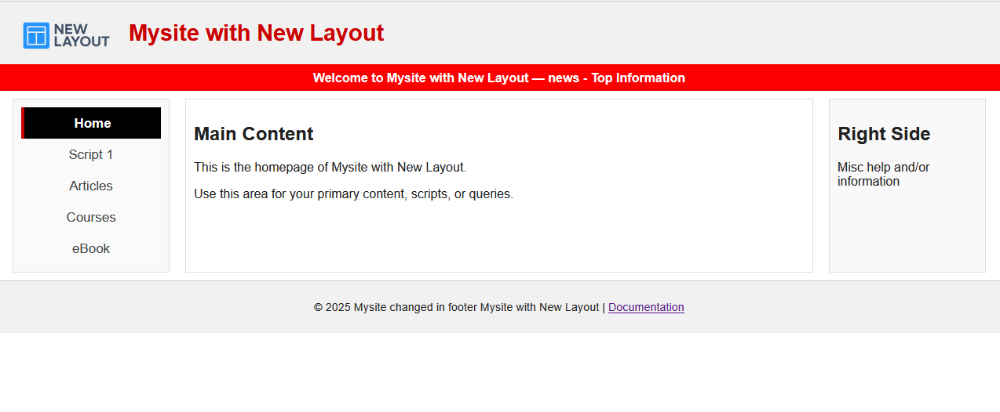
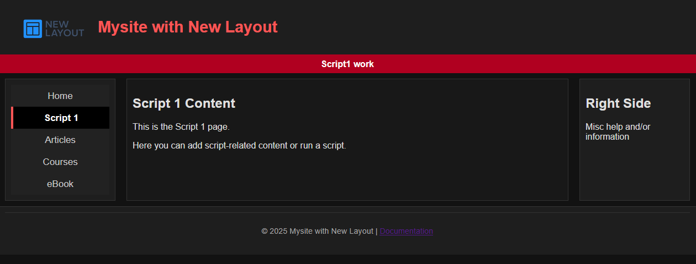

Perfect, Michael — here’s the full README updated to include **theme toggling instructions** and a **dark mode screenshot**. This makes it clear to recruiters and collaborators that your project supports both light and dark themes.

```markdown
# NewLayout Project

A modular, responsive PHP + CSS layout designed to serve as the base for menu‑driven content in the center and other web applications. Built with **Flexbox** for maintainability and semantic HTML for clarity. 

---

# 🚀 Quick Start

Clone the repo and run it locally:

```bash
git clone https://github.com/yourusername/NewLayout.git
cd NewLayout
php -S localhost:8000
```

Then open [http://localhost:8000](http://localhost:8000) in your browser.

### 📸 Screenshots

<!-- 
**Light Theme (default):**



**Dark Theme:**




<p align="center">
  
  
</p>
-->

Click the thumbnails below to view full‑size screenshots:
<p align="center">
  <a href="docs/quickstart.png">
    
  </a>
  <a href="docs/quickstart-dark.png">
    
  </a>
</p>

---

# 🎨 Theme Support

This project supports **light** and **dark** themes out of the box.

- Set the theme in `config.php`:
  ```php
  define('THEME', 'light'); // or 'dark'
  ```
- The header will automatically load `css/BaseLayout-light.css` or `css/BaseLayout-dark.css` depending on the constant.
- Screenshots above show both modes for quick reference.

---

# Laying out a standard layout

## 📐 Layout Structure

The site is divided into six main sections:

1. **Header (Logo + Title)**  
   - Displays the site logo and title side‑by‑side using Flexbox.  
   - Logo is constrained for consistent sizing.  
   - Title uses semantic `<h1>` styling.

2. **Top Information Banner**  
   - A horizontal bar for notices, alerts, or scrolling messages.  
   - Styled with a bold background color for visibility.

3. **Left Menu (Navigation)**  
   - Modular navigation loaded from `templates/leftcolumn.php`.  
   - Uses semantic `<nav>` and `<ul>` for accessibility.  
   - Active link styling highlights the current page.

4. **Main Content Area**  
   - Central section (`<main>`) where page‑specific content is displayed.  
   - Each script (e.g., `scripts1.php`) loads its own content here.

5. **Right Content Column**  
   - Supplemental information, tips, or contextual help.  
   - Modularized in `templates/rightcolumn.php`.

6. **Footer**  
   - Contains copyright, site name, and optional links.  
   - Modularized in `templates/footer.php`.

---

## 🗂 File Organization

```
NewLayout/
├── config.php              # Root configuration file (constants, settings)
├── css/
│   ├── BaseLayout-light.css # Light theme stylesheet
│   └── BaseLayout-dark.css  # Dark theme stylesheet
├── templates/
│   ├── header.php          # Header section
│   ├── leftcolumn.php      # Navigation menu
│   ├── rightcolumn.php     # Right content
│   └── footer.php          # Footer section
├── scripts/
│   ├── scripts1.php        # Example script page
│   └── ...                 # Additional script pages
├── docs/
│   ├── quickstart.png      # Light theme screenshot
│   └── quickstart-dark.png # Dark theme screenshot
└── index.php               # Main homepage
```

---

## ⚙️ Usage

- **Configuration**:  
  Edit `config.php` to set constants like `TITLE`, `HOST_NAME`, and `THEME`.

- **Adding new pages**:  
  Create a new file in `/scripts/` and include the modular templates:
  ```php
  require_once __DIR__ . '/../config.php';
  require_once __DIR__ . '/../templates/header.php';
  ...
  ```

- **Styling**:  
  Update `css/BaseLayout-light.css` or `css/BaseLayout-dark.css` for layout changes.  
  Responsive rules are included for screens under 768px.

---

## 🎯 Goals

- Maintain a **modular structure** for easy updates.  
- Ensure **responsive design** across desktop and mobile.  
- Provide a **clear base layout** for future scripts and applications.  
- Make the repo **recruiter‑ready** with clean documentation and semantic code.
```

---

### ✅ What changed
- Added **Theme Support section** with instructions for toggling light/dark.  
- Added **Dark Mode Screenshot** reference (`docs/quickstart-dark.png`).  
- Updated file tree to include both `BaseLayout-light.css` and `BaseLayout-dark.css`.  

